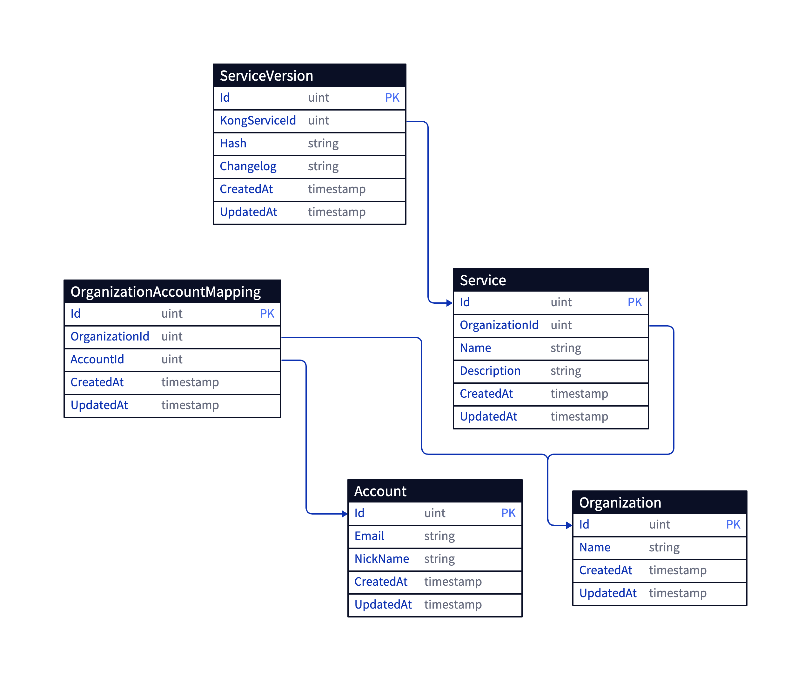

Kong service demo
=====
[](https://coveralls.io/github/dcalsky/kong_service_demo?branch=main)

This demo project provides several APIs to view and manage kong's services, organizations and accounts with authentication and authorization.

---

- **[Quickstart](#get-started)**
- **[Tech Introduction](#tech-introduction)**
- **[Entities Introduction](#entities-introduction)**
- **[API](#api)**
- **[Roadmap](#roadmap)**

---

# Get Started

Step1: Clone repo to local

```shell
git clone https://github.com/dcalsky/kong_service_demo.git
```

Step2: Run the service

* Option 1: run locally

Service runs on port 8002, it requires golang >= 1.21 under your environment.

```shell
make run
```

* Option 2: run with Docker

This approach requires a running docker daemon.

```shell
docker build -t kong_demo_service .
docker run -p 8002:8002 kong_demo_service
```

Step3: Detect the health of service

```shell
curl http://localhost:8002/ping
```

It should output `{"Message":"pong!"}`.

# Tech Introduction

---

- **[Tech Stack](#tech-stack)**
- **[Configuration Loader](#configuration-loader)**
- **[Error Propagation and Display](#error-propagation-and-display)**
- **[JWT](#jwt)**
- **[Request ID](#request-id)**
- **[Logging](#logging)**
- **[Transaction](#transaction)**
- **[Testing](#testing)**

---

## Tech Stack

* Web framework: [hertz](https://github.com/cloudwego/hertz)
* Database & ORM: [sqlite](https://github.com/mattn/go-sqlite3) and [gorm](https://gorm.io/)
* Logger: [zap](https://github.com/uber-go/zap/)
* Test: [testify](https://github.com/stretchr/testify) and [go mock](https://github.com/uber-go/mock)

Due to go-sqlite3, the program has to be compiled with CGO_ENABLED=1 flag (see build.sh).

## Configuration Loader

All configuration files are under `./conf` folder. Under any environment, the `base.yaml` configuration file will be
loaded. If it is missing, the program will not launch properly.

Other configuration files will be loaded under specific environments, depending on the `CLUSTER_ENV` environment
variable.
When `CLUSTER_ENV` is set to "prod", the `prod.yaml` will be loaded and overrides `base.yaml`.

However, this does not mean
that all config items in base.yaml will be overridden. If some config items exist in `base.yaml` but are absent in
`prod.yaml`, those config items will still be loaded and will not disappear.

See more detail in [config.go](./internal/config/config.go).

## Error Propagation and Display

### Error definition

Every error in our service is an exception. Considering that they will eventually be thrown to the user, they store
information such as the HTTP status code, a unique code of type string, and a info message. And the exception also store
the primitive error.

```go
type Exception struct {
error             // original error
StatusCode int    // error http status code
Code       string // error code
Message    string // standard error message to user
RawError   string // original error text
}
```

I define command and specified exceptions in the [error.go](./internal/base/error.go), they will be referenced directly
by various modules as global variables.

```go
InvalidParamErr   = NewException(400, "InvalidParam", "An invalid request payload is supplied.")
ResourceNotFound = NewException(404, "ResourceNotFound", "The specified resource is not found.")
InternalError = NewException(500, "InternalError", "There is an internal error occurred.")
ResourceInUse = NewException(409, "ResourceInUse", "The specified resource already exists.")
RateLimitExceeded = NewException(429, "RateLimitExceeded", "Request is due to rate limit.")
PermissionDenied = NewException(403, "PermissionDenied", "You have no permission to do this operation.")
Unauthorized = NewException(401, "Unauthorized", "Unauthorized identity.")

ExceedMaximumKongServiceName = NewException(400, "InvalidParam.ExceedMaximumKongServiceName", "The specified name is too long.")
InvalidKongServiceId = NewException(400, "InvalidParam.InvalidKongServiceId", "The specified id is invalid.")

NotFoundKongService = NewException(404, "ResourceNotFound.NotFoundKongService", "The specified kong service is not found.")
PasswordLengthErr   = NewException(400, "InvalidParam.PasswordLengthErr", "The length of password must be controlled by 8-20.")
EmailFormatErr = NewException(400, "InvalidParam.EmailFormatErr", "The email format is invalid.")
...
```

### How to catch and delivery the error from different layers

When we handle business logic, both expected and unexpected errors may occur. The usual practice in Golang is
to `capture
these errors and propagate them to the upper layer`. However, when the logic resides in a lower layer (such as the
adapter layer), propagating errors layer by layer can become cumbersome for development.

Therefore, I used the `panic & recover`. First, I implemented an `exception guard in the middleware`, then allowed
a panic to be thrown at any layer. This way, the panic will always be recovered in the exception guard and handled
accordingly.

When a panic has been caught, in addition to returning the error itself, the service will also log the error stack to
facilitate subsequent troubleshooting. Using `runtime.Callers` to skip and get current callers.

See how exception capturing works in the [exception_guard.go](./internal/middleware/exception_guard.go).

## JWT

### Authentication

After user login, a jwt token will be generated and returned to the client. The client must store it and carry it to
following requests.

The jwt validator middleware is responsible to validate whether the token in the HTTP header is legal. However, not all
routes fall under the scope of the jwt validator. For example, the Login and Register APIs can be
exempted.

### Payload

Kong demo service use jwt payload to carry user limited information in the token, such as user id. In the following
requests, after parsing jwt token, server would know which user sends this request, then put the his id to the
context.

```go
func JwtValidator(secret string) app.HandlerFunc {
...
return func (c context.Context, ctx *app.RequestContext) {
...
claims := jwtClaimsPool.Get().(*dto.JwtClaims)
token, err := jwtParser.ParseWithClaims(tokenStr, claims, keyFunc)
...
// Set account id to the context from jwt payload
base.SetKongArgsAccountId(ctx, claims.AccountId)
base.SetKongArgsAccountEmail(ctx, claims.Email)
ctx.Next(c)
}
}
```

See more detail in the [jwt validator](./internal/middleware/jwt_validator.go).

## Request ID

Generate and attach an unique id for each request can chain the logs and really help us to trace the problem when
exceptions occurred.

I made a toy request id generator, it generates an unique in the traffic logger middleware and insert it to the context.
Therefore, until the request ends, all logs carry this request id to print.

See [traffic logger](./internal/middleware/traffic_logger.go) and [logid](./internal/common/logid/logid.go) for more
details.

## Logging

The service uses zap (because of fast and less allocation) as its logger. I have encapsulated 5 commonly used logging
functions according to log levels,
making it convenient to call them directly in the business code.

In production, investigate issues from logs is an important approach. Each log carries following information:

1. log message
2. log level
3. caller
4. request id
5. timestamp

```go
func Fatalf(ctx context.Context, template string, args ...any) {
zapLogger.Fatal(logid.LogId(ctx) + " " + fmt.Sprintf(template, args...))
}

func Errorf(ctx context.Context, template string, args ...any) {
zapLogger.Error(logid.LogId(ctx) + " " + fmt.Sprintf(template, args...))
}

func Warnf(ctx context.Context, template string, args ...any) {
zapLogger.Warn(logid.LogId(ctx) + " " + fmt.Sprintf(template, args...))
}

func Infof(ctx context.Context, template string, args ...any) {
zapLogger.Info(logid.LogId(ctx) + " " + fmt.Sprintf(template, args...))
}

func Debugf(ctx context.Context, template string, args ...any) {
zapLogger.Debug(logid.LogId(ctx) + " " + fmt.Sprintf(template, args...))
}
```

## Transaction

The majority of the business logic is organized in the service layer, while the repository (repo) layer is responsible
for simple interactions with the persistent database.

Therefore, for the service layer, it is necessary to use database transactions to ensure the consistency of complex
business logic operations.

I build a RepoHelper, which can be used in the services and repos. The service layer uses it initialize a transaction
then pass it down to the repo layer by the context. Once repo layers judges there is a transaction in the context, use
it.

```go
type IRepoHelper interface {
MustTransaction(ctx context.Context, cb func (ctx context.Context))
WithContext(ctx context.Context) *gorm.DB
}
```

### Usage

```go
func (s *kongService) CreateKongService(ctx context.Context, kongArgs base.KongArgs, req dto.CreateKongServiceRequest) dto.CreateKongServiceResponse {
  ...
  s.repoHelper.MustTransaction(ctx, func(ctx context.Context) {
    // A transaction already been insert to the context.
      
    // get the detail of current account
    account, err = s.accountRepo.DescribeAccountById(ctx, entity.AccountId(kongArgs.AccountId))
    base.PanicIfErr(err, base.InternalError.WithRawError(err))
    base.PanicIf(account == nil, base.Unauthorized.WithRawError(fmt.Errorf("account not found, id: %d", kongArgs.AccountId)))

    // verify whether the current account is the member of the organization
    accountIsOrgMember, err := s.accountRepo.IsAccountInOrganization(ctx, entity.AccountId(kongArgs.AccountId), entity.OrganizationId(req.OrganizationId))
    base.PanicIfErr(err, base.InternalError.WithRawError(err))
    base.PanicIf(!accountIsOrgMember, base.PermissionDenied.WithRawError(fmt.Errorf("account not in organization, account id: %d, organization id: %d", kongArgs.AccountId, req.OrganizationId)))

    ks = entity.NewKongService(entity.AccountId(kongArgs.AccountId), entity.OrganizationId(req.OrganizationId), req.Name, req.Description)
    err = s.kongServiceRepo.CreateService(ctx, &ks)
    base.PanicIfErr(err, base.InternalError.WithRawError(err))
  })
  ...
}

func (s *accountRepo) DescribeAccountById(ctx context.Context, id entity.AccountId) (*entity.Account, error) {
  var account entity.Account
  // get the transaction instance from the context
  err := s.db.WithContext(ctx).Where("ID = ?", id).First(&account).Error
  if err != nil {
    if errors.Is(err, gorm.ErrRecordNotFound) {
      return nil, nil
    }
    return nil, err
  }
  return &account, nil
}

```

See the repo helper implementation in the [helper.go](./internal/adapter/repo/helper.go).

## Testing

### Mocking

Use [gomock](https://github.com/uber-go/mock) to create mockup instances as dependencies for testing.

### Coverage

Use [coveralls](https://coveralls.io/) as the service for stat testing coverage. And do tests then publish final result by github action.

See the coverage workflows in [github action config file](./.github/workflows/coverage.yaml).

# Entities Introduction

There are 4 main entity concepts: Account, Organization, Kong Service and Kong Service Version.



## Account

User should register an account before making most of the operations.

The password stored in database is irreversible hashed. And an email once has been taken, others can't register by this
email again.

```go
type AccountId uint

type Account struct {
ID        AccountId
Email     string
NickName  string
Password  string
CreatedAt time.Time
UpdatedAt time.Time
}

```

## Organization

An organization can hold multiple accounts, while an account can join some different organizations, so they are
many-to-many relationship.

An account can be invited to an organization by the member of this organization or create an own organization. Also, an
account in the organization can leave and kick others out.

```go
type OrganizationId uint
type OrganizationAccountMappingId uint

type Organization struct {
ID        OrganizationId
Name      string
CreatedAt time.Time
UpdatedAt time.Time
}

type OrganizationAccountMapping struct {
ID             OrganizationAccountMappingId
AccountId      AccountId
OrganizationId OrganizationId
CreatedAt      time.Time
UpdatedAt      time.Time
}

```

## Kong Service

A kong service belongs to an organization. Although it keeps its creator id, its creator should be still in the
organization so that he can manage this kong service.

The kong service keeps a pointer aiming at the current version of it. Account who has permission can switch this
version.

```go
type KongServiceId uint

type KongService struct {
ID             KongServiceId
OrganizationId OrganizationId // belong organization
CreatorId      AccountId      // created by who
VersionId      *KongServiceVersionId // current version, nil means no version
Name           string
Description    string
CreatedAt      time.Time
UpdatedAt      time.Time
}

```

## Kong Service Version

Each kong service can have different versions, and each version records a changelog. The creator id field means who
created this version.

```go
type KongServiceVersionId uint

type KongServiceVersion struct {
Id            KongServiceVersionId
KongServiceId KongServiceId // belong service
Hash          string        // the unique hash for version
Changelog     string    // changelog message
CreatorId     AccountId // the creator of this version
CreatedAt     time.Time
UpdatedAt     time.Time
}

```

# API

## Request & Response

### Request

Method: POST

Base URL: https://example.com

HTTP Headers:

- Authorization: `<your token, get by Login API>`
- Content-Type: `application/json`

### Response

**Common Response**:

```json
{
  "Meta": {
    "RequestId": "unique id for this request (string)"
  },
  "Data": "Response Result"
}
```

**Error Response**

```json
{
  "Meta": {
    "RequestId": "unique id for this request (string)",
    "Error": {
      "Code": "exception code (string)",
      "Message": "exception message (string)",
      "Detail": "the detail of exception (string) (only available in local)"
    }
  }
}
```

## Session APIs (no authenticated required)

### /api/v1/Register

Register an account by email and password. Email is unique and the password will be hashed before saving into the
database.

```go
type AccountForDetail struct {
Id        uint
Email     string
NickName  string
CreatedAt int64
UpdatedAt int64
}
```

Types:

```go
type RegisterRequest struct {
Email    string `json:",required"`
NickName string `json:",required"`
Password string `json:",required"`
}

type RegisterResponse struct {
Token   string
Account AccountForDetail
}
```

### /api/v1/Login

Use email and password to login, get a JWT token and account detail.

JWT claims payload:

```go
type JwtClaims struct {
AccountId uint
Email     string
ExpiredAt time.Time
}
```

Types:

```go
type LoginRequest struct {
Email    string `json:",required"`
Password string `json:",required"`
}

type LoginResponse struct {
Token   string
Account AccountForDetail
}
```

## Kong Service APIs

### /api/v1/CreateKongService

Specifying the organization and service name to create a kong service.

Limitation:

- Current account must in the organization

Types:

```go
type KongServiceForDetail struct {
Id               uint
Name             string // the name of the service
Description      string // what is the service about
CurrentVersionId *uint                         // the id of the current version, optional
Versions         []KongServiceVersionForDetail // the versions of the service
CreatedAt        int64
UpdatedAt        int64
}

type CreateKongServiceRequest struct {
Name           string `json:",required"` // the name of the service
Description    string `json:",required"` // what is the service about
OrganizationId uint   `json:",required"` // the organization the service wants to join
}

type CreateKongServiceResponse struct {
Service KongServiceForDetail
}
```

### /api/v1/DescribeKongService

Use id to get the detail of kong service.

Types:

```go
type DescribeKongServiceRequest struct {
Id uint `json:",required"`
}

type DescribeKongServiceResponse struct {
Service KongServiceForDetail
}
```

### /api/v1/DeleteKongService

Delete a kong service.

Limitation:

- Current account must in the organization that owns this kong service. Otherwise, the account can't delete it even if
  he is the creator of the service.

Types:

```go
type DeleteKongServiceRequest struct {
Id uint `json:",required"`
}
```

### /api/v1/ListKongServices

Search kong service paginationly. The page size in the pagination is default 10, the page number starts at 1.

OrderBy receives the ordering fields, the priorities are in descending. If you want to sort a field in reverse order,
prefix the field with "-". Example: ["-CreatedAt", "Name"] means sorting by creation time in reverse order and by name
in positive order.

Supporting searching fields:

- Name
- Description
- Name and Description

Available ordering fields:

- Id
- UpdatedAt
- CreatedAt
- Name

Types:

```go

type PagingOption struct {
PageSize int64
PageNum  int64
}

type PagingResult struct {
PageSize int64
PageNum  int64
Total    int64
}

type KongServiceForList struct {
Id               uint
Name             string // the name of the service
Description      string // what is the service about
VersionAmount    int   // how many versions does this service have
CurrentVersionId *uint // the id of the current version
CreatedAt        int64
UpdatedAt        int64
}

type ListKongServicesRequest struct {
Name        *string // fuzzy search by service name
Description *string // fuzzy search by service description
Fuzzy       *string       // fuzzy search by both service name and description. If this field filled, Name and Description fields will be ignored.
Pagination  *PagingOption // the pagination option, default, page size: 10, page number: 1
SortBy      []string      // the sort option, default, sort by id. Supporting fields: Id, UpdatedAt, CreatedAt, Name. Add "-" prefix for descending order, Example: ["-CreatedAt", "Name"]
}

type ListKongServicesResponse struct {
Services   []KongServiceForList
Pagination PagingResult
}

```

### /api/v1/UpdateKongService

Update the name or description of a kong service.

Limitation:

- Current account must in the organization that owns this kong service.

Types:

```go
type UpdateKongServiceRequest struct {
Id          uint `json:",required"`
Name        *string
Description *string
}

type UpdateKongServiceResponse struct {
Service KongServiceForDetail
}
```

### /api/v1/CreateKongServiceVersion

Create a new version for the kong service. Set SwitchToNewVersion to true to switch the current version of kong service
to new one.

Limitation:

- Current account must have the permission for specified kong service.

Types:

```go

type CreatorInKongServiceVersion struct {
Id       uint
Email    string
NickName string
}

type KongServiceVersionForDetail struct {
Id            uint
KongServiceId uint
Creator       CreatorInKongServiceVersion
Changelog     string
CreatedAt     int64
UpdatedAt     int64
}

type CreateKongServiceVersionRequest struct {
KongServiceId      uint   `json:",required"`
Changelog          string `json:",required"`
SwitchToNewVersion *bool
}

type CreateKongServiceVersionResponse struct {
Version KongServiceVersionForDetail
}

```

### /api/v1/SwitchKongServiceVersion

Switch the current version of kong service to the specified one.

Limitation:

- Current account must have the permission for specified kong service.

Types:

```go
type SwitchKongServiceVersionRequest struct {
KongServiceId uint `json:",required"`
VersionId     uint `json:",required"`
}

type SwitchKongServiceVersionResponse struct {
KongService KongServiceForDetail
}

```

## Organization APIs

### /api/v1/CreateOrganization

Create an new organization, current account is becoming one of its members.

```go
type OrganizationForDetail struct {
Id        uint
Name      string
Members   []AccountForDetail
CreatedAt int64
UpdatedAt int64
}

type CreateOrganizationRequest struct {
Name string `json:",required"`
}

type CreateOrganizationResponse struct {
Organization OrganizationForDetail
}
```

### /api/v1/DescribeOrganization

Get the detail of organization.

Limitation:

- Current account is a member of the specified organization.

Types:

```go
type DescribeOrganizationRequest struct {
Id uint `json:",required"`
}

type DescribeOrganizationResponse struct {
Organization OrganizationForDetail
}

```

### /api/v1/AddAccountToOrganization

Add an account to the specified organization who haven't joined.

Limitation:

- Current account is a member of the specified organization.

Types:

```go
type JoinOrganizationRequest struct {
AccountId      uint `json:",required"`
OrganizationId uint `json:",required"`
}
```

### /api/v1/RemoveAccountFromOrganization

remove an account to the specified organization who have joined.

Limitation:

- Current account is a member of the specified organization.

```go
type QuitOrganizationRequest struct {
AccountId      uint `json:",required"`
OrganizationId uint `json:",required"`
}

```

# Roadmap

- [ ] pprof: performance tracing
- [ ] Authorization enhancement: role based access controlling
- [ ] Database mockup for testing